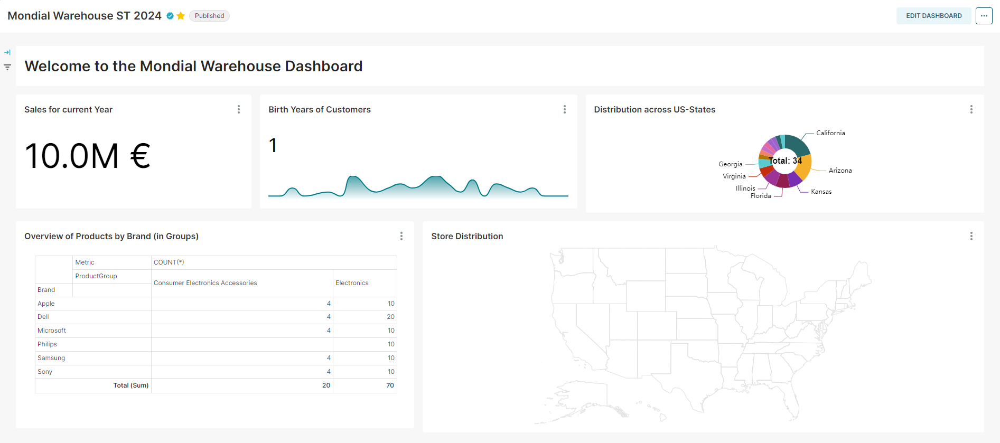

# Exercise 7: Analytical Queries

The objective of this assignment is to familiarize students with the concepts of analytical queries in a database management system and to develop their skills in writing and executing complex queries for analytical purposes.

In today's data-driven landscape, the effective utilization of database systems is paramount for informed decision-making and streamlined operations. This case study delves into a scenario within a hypothetical organization where database utilization, particularly in conjunction with Apache Superset, has come under scrutiny.

## Scenario Overivew

A working colleague recently undertook the installation of Apache Superset, an open-source business intelligence tool, to explore its capabilities within the organization. As part of this exploration, a dashboard was created leveraging the available datasets. However, upon initial assessment, it was determined that the dashboard, while functional, lacked the robustness required for production use. Concurrently, another colleague highlighted discrepancies within the `warehouse` dataset, indicating potential data integrity issues.

## Exercise 7-1: Data Exploration in Mondial and the Warehouse Schema

1. Analyze the existing data in both the Mondial (`public`)schema and the `warehouse` schema to identify discrepancies and missing information.
2. Compare the schema structures of `public` and `warehouse` to understand any differences in data organization and attributes.
3. Perform and document queries to extract relevant information from both datasets, focusing on areas where data is missing or incomplete.
4. Document findings and prepare a report outlining the data exploration process, including any inconsistencies or gaps discovered.

## Exercise 7-2: Upload the New Data from the import.sql File to the Warehouse

1. Review the contents of the [`import.sql`](files/import.sql) file to understand the structure and format of the new data.
2. Prepare the warehouse database for data insertion, ensuring compatibility with the existing schema.
3. Execute SQL scripts or utilize ETL (Extract, Transform, Load) processes to upload the new data from the import.sql file into `warehouse`.
4. Validate the data upload process by cross-referencing with existing datasets and performing data integrity checks.
   Update documentation to reflect the addition of new data and any modifications made to the warehouse schema.

## Exercose 7-3: Dashboard Production Use

Below you find the overview of the current dashboard. Head over to [Apache Superset of Pforzheim University](https://superset.hs-pforzheim.de) and open `Mondial Warehouse ST 2024`. Although this dashboard was tested for development purposes does not mean it is ready for production use.

1. Identify the issues or discrepancies in the existing dashboard, focusing specifically on the map diagram component.
1. Review the dashboard configuration and underlying data sources to pinpoint the root cause of the problem.
1. Implement necessary fixes or adjustments to the map diagram, such as correcting data mappings, resolving visualization errors, or updating query logic. A working colleague mentioned there is something wrong with the mapping of states.
1. Conduct thorough testing to ensure that the dashboard functions correctly after the fixes have been applied, including testing different scenarios and edge cases.
1. Document the troubleshooting and resolution process, including any changes made to the dashboard configuration or code, for future reference (Superset allows an export of your dashboard).

## Conclusion

In summary, this case study underscores the critical role of database systems in facilitating data-driven decision-making within organizations. By addressing challenges related to dashboard reliability and data integrity, the organization can unlock the full potential of its data assets, driving efficiency, innovation, and competitive advantage in today's dynamic business landscape.
